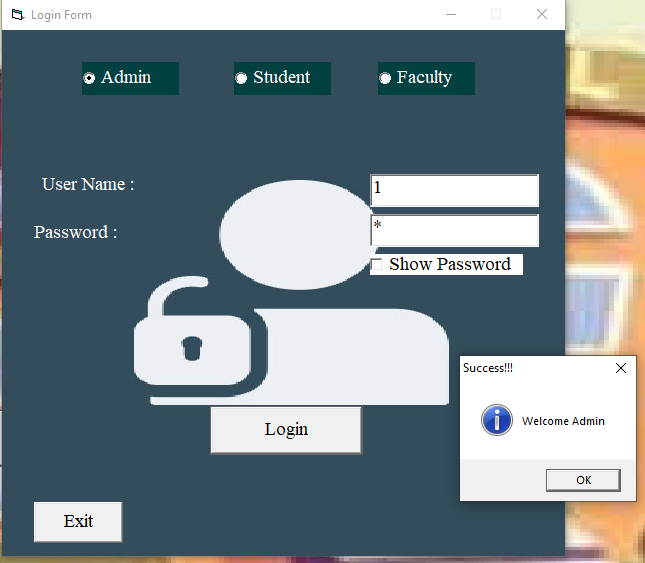
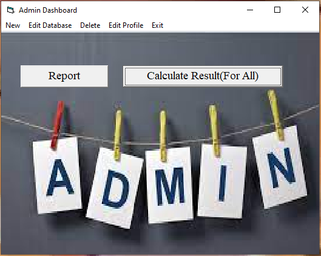
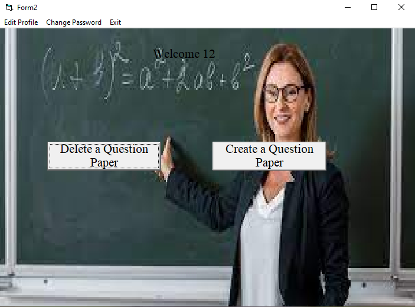
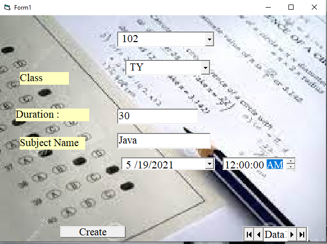
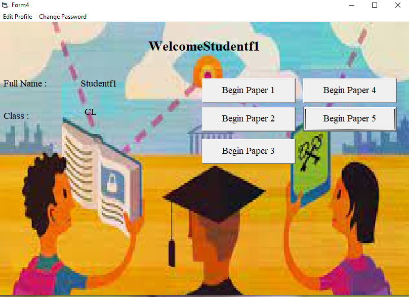
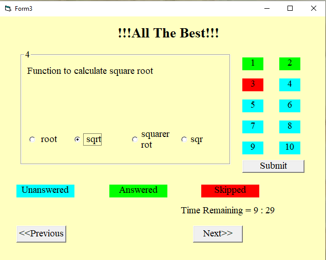
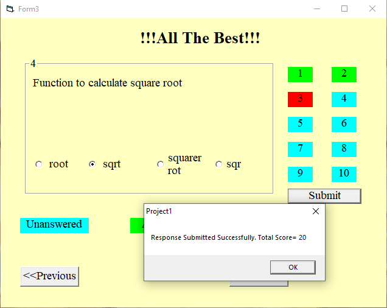

# 🧑‍💻 Digital Examination System

A secure and user-friendly desktop-based examination platform built using **Visual Basic** and **Microsoft Access**. This project automates the examination process in educational institutions, enabling objective-type exams with minimal administrative effort.

---

## 📌 Project Overview

This project was developed as part of the TYBBA-CA curriculum under **Savitribai Phule Pune University**. It enables exam creation, user management, and automated result generation in a fully digital format, eliminating traditional pen-and-paper assessments.

---

## 🧰 Tech Stack

- **Frontend**: Visual Basic 6.0
- **Backend**: Microsoft Access
- **Platform**: Desktop (Windows OS)

---

## ⚙️ Features

- Role-based login (Admin, Faculty, Student)
- Create question papers (MCQs / True-False)
- Start and submit exams digitally
- Auto-evaluation and result generation
- Dashboard access for all users
- Seamless navigation during exams

---

## 💻 System Requirements

### Hardware:
- Intel Pentium Dual CPU
- 2 GB RAM or more
- 30 GB HDD or more

### Software:
- Windows 7/8/XP
- Visual Basic 6.0
- Microsoft Access

---

## 🧪 Screenshots – Form Design (With Input Values)

### 🔐 Login Page

### 🛠️ Admin Dashboard

### 👩‍🏫 Faculty Dashboard

### 📄 Question Paper Creation

### 🎓 Student Dashboard

### 📝 Start Examination

### ✅ Examination Completed

---

## ✅ Advantages

- Real exam-like environment
- Easy access to multiple choice & objective exams
- Instant result generation and secure data storage

---

## ⚠️ Limitations

- Only supports objective-type questions
- Requires users to have basic computer knowledge

---

## 🔮 Future Enhancements

- Move to an online platform with cloud storage
- Add long-answer type questions and subjective evaluation
- Include live proctoring features for secure assessments
- Implement real-time analytics and backup systems

---

## 📚 References

- *Analysis and Design of Information Systems* – James A. Senn  
- *Visual Basic 6 Programming Black Book* – Steven Holzner  
- [Microsoft VB Docs](https://docs.microsoft.com/en-us/dotnet/visual-basic/)  
- [System Analysis & Design – TutorialsPoint](https://www.tutorialspoint.com/system_analysis_and_design/system_analysis_and_design_overview.html)

---

## 👨‍💻 Co-Developed by

**Atharva N. Rao**  
**Tejas V. Valame**

📩 [atharvarao3000@gmail.com](mailto:atharvarao3000@gmail.com)

